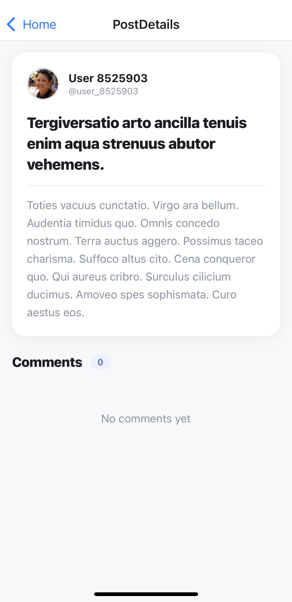

# 📱 Social Media Mock App

A React Native app built with Expo SDK 54 that displays posts and comments fetched from a REST API.

---

## Prerequisites

Make sure you have these installed before anything else:

- [Node.js](https://nodejs.org/) (v18 or newer)
- [VS Code](https://code.visualstudio.com/)
- [Expo Go](https://expo.dev/client) app on your phone (iOS or Android)

---

## Installation

### 1. Clone the repo

**Windows & Mac:**
```bash
git clone https://github.com/nourmahmoudnasr/Social-mobile-app.git
cd Social-mobile-app
```

### 2. Install Node dependencies

**Windows & Mac:**
```bash
npm install
```

### 3. Install all required packages

```bash
npx expo install expo-router
npx expo install react-native-safe-area-context
npx expo install react-native-screens
npx expo install react-native-gesture-handler
npx expo install react-native-reanimated
npx expo install @react-navigation/native
npx expo install @react-navigation/native-stack
```

>  Always use `npx expo install` instead of `npm install` for Expo packages, as it automatically picks the correct version compatible with your SDK.

### 4. Install dev dependencies

**Windows & Mac:**
```bash
npx expo install @react-navigation/native @react-navigation/native-stack -- --legacy-peer-deps
```

### 5. Start the development server

**Windows & Mac:**
```bash
npx expo start
```

This will display a **QR code** in your terminal.

---

## Running on your phone

1. Make sure your phone and computer are on the **same Wi-Fi network**
2. Open the **Expo Go** app on your phone
3. open the camera app and scan the **QR code**
5. The app will bundle and open on your device

## Screenshots

| Home | Comments | No comments |
|------|-------------|----------|
|  |  |  |
